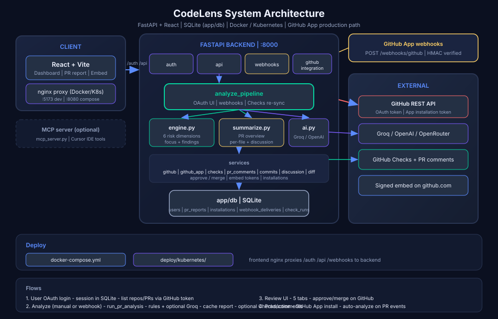

# CodeLens

**Understand a pull request before reviewing it.**

CodeLens is a GitHub-based tool that analyzes pull requests and gives reviewers a structured brief before they read the full diff. It answers: *What changed? How risky is it? Where should I focus?*

---

## Table of contents

- [Product Requirements Document](#product-requirements-document)
- [Implementation status](#implementation-status)
- [Problem](#problem)
- [Architecture](#architecture)
- [Tech stack](#tech-stack)
- [Functionalities](#functionalities)
- [Project structure](#project-structure)
- [Setup](#setup)
- [Environment variables](#environment-variables)
- [User flow](#user-flow)
- [API reference](#api-reference)
- [PR analysis dimensions](#pr-analysis-dimensions)
- [Demo without GitHub](#demo-without-github)
- [MCP server (optional)](#mcp-server-optional)
- [Scripts](#scripts)

---

## Product Requirements Document

> Original hackathon PRD — *Understand a pull request before reviewing it*

### 1. The Problem

Code reviews become harder as pull requests grow in size and complexity. Before a reviewer can meaningfully inspect the code, they often need to figure out what changed, how broad the change is, what areas may be affected, and where the highest-risk parts are.

This information is often spread across the diff, repository context, existing development tools, and the reviewer's own investigation.

The opportunity is to give engineers a fast, structured view of a pull request before they begin a detailed manual review.

### 2. The Core Idea

CodeLens is a GitHub-based tool that automatically analyzes a pull request and surfaces the signals a reviewer needs to understand the change.

The goal is **not** to replace code review. The goal is to make human review faster and more focused by answering:

**What changed, how risky is it, and where should I look more closely?**

### 3. Who Is It For?

- Developers reviewing pull requests
- Developers seeking early feedback on their own changes
- Tech leads and engineering managers who want visibility into change risk

### 4. Core Scope

The solution should explore how a PR can be analyzed across meaningful dimensions:

- **Change and drift** — How much has changed, and does the change appear broader than its stated purpose?
- **Code volume** — How large is the PR relative to the repository or normal changes?
- **Functionality** — Does the PR appear to address one coherent piece of functionality or several?
- **Critical functionality** — Does the change affect authentication, payments, permissions, data handling, infrastructure, or other business-critical paths?
- **Code quality** — Are there meaningful maintainability, complexity, readability, or error-handling concerns?
- **Security** — Are there potential vulnerabilities, unsafe patterns, secrets, dependency risks, or security-sensitive changes?
- **Test coverage** — Are the important parts of the change adequately covered by tests?

### 5. GitHub Context

- A reviewer should be able to use CodeLens in the context of a GitHub pull request.
- The analysis should consider the PR diff and relevant repository context.
- Results should be understandable within the normal review workflow.
- The experience should avoid creating unnecessary noise for authors or reviewers.

### 6. Expected Outcome

Build a working prototype that demonstrates how CodeLens could help an engineer understand a PR before performing a detailed manual review.

The prototype should make it possible to see the important signals from a change and understand why those signals matter.

The exact interface, scoring system, analysis approach, AI usage, integrations, and technical architecture are intentionally open.

### 7. Constraints and Non-Goals

- GitHub is the environment for the initial concept.
- Human review remains the final decision-maker.
- Do not build an automatic approval or merge system.
- Do not optimize for generating the largest number of findings.
- Prioritize useful, explainable signals over generic AI-generated prose.
- Do not try to replace every existing developer or security tool.
- Keep the first experience focused enough to be useful during an actual PR review.

### 8. What Teams Should Decide

Teams are expected to make product and technical decisions around:

- What should a reviewer see first?
- Which signals deserve the most attention?
- How should risk or confidence be represented?
- What evidence should accompany a finding?
- When should CodeLens stay quiet?
- How much repository context is necessary?
- How should AI and existing developer tools work together?
- Where should the experience live within GitHub?

### 9. Success Criteria

- A clear understanding of the code-review problem.
- A focused experience that helps reviewers orient themselves quickly.
- Useful and explainable analysis rather than unsupported claims.
- Thoughtful prioritization of risk and reviewer attention.
- A working prototype that makes the value of CodeLens easy to understand.

### 10. The Challenge

Design and build a product that helps an engineer go from:

*"I have a large pull request. Where do I start?"*

to:

*"I understand this change, I know what looks risky, and I know where to focus my review."*

### 11. Reference

For reference, participants can refer to [CodeRabbit](https://coderabbit.ai) and take inspiration.

---

## Implementation status

Legend: ✅ Implemented · ⚠️ Partial · ❌ Not implemented

### PRD core scope → backend analyzers

| PRD dimension | Status | Backend | Notes |
|---------------|--------|---------|-------|
| Change and drift | ✅ | `backend/app/analyzers/engine.py` → `detect_scope_drift()` | Multi-module clusters, title/body mismatch |
| Code volume | ✅ | `engine.py` → `analyze_volume()` | Lines changed, large files vs ~200-line baseline |
| Functionality | ✅ | `engine.py` → `analyze_functionality()` | Coherent vs scattered module changes |
| Critical functionality | ✅ | `engine.py` → `detect_critical_paths()` | Auth, payments, permissions, data, infra, API |
| Code quality | ❌ | — | No dedicated maintainability/complexity analyzer yet |
| Security | ✅ | `engine.py` → `scan_security()` | Secrets, eval, SQL concat, XSS, TLS disable |
| Test coverage | ✅ | `engine.py` → `check_test_coverage()` | Source changed without matching test files |

### PRD GitHub context & workflow

| Requirement | Status | Backend | Frontend |
|-------------|--------|---------|----------|
| GitHub OAuth login | ✅ | `routers/auth.py` | `pages/Login.jsx` |
| Session management | ✅ | `routers/auth.py` (JWT cookie) | `context/AuthContext.jsx` |
| List user repositories | ✅ | `routers/api.py` + `services/github.py` | `pages/Dashboard.jsx` |
| List open PRs | ✅ | `routers/api.py` | `pages/RepoDetail.jsx` |
| Analyze PR diff from GitHub | ✅ | `routers/api.py` → `github.list_pr_files()` | `pages/PrReport.jsx` |
| Cached reports | ✅ | `models.py` → `PrReport` | `api/client.js` → `report()` |
| Re-analyze on demand | ✅ | `POST .../analyze` | `PrReport.jsx` → Re-analyze button |
| PR diff in review workflow | ✅ | patches in analyze response | `components/DiffViewer.jsx`, `FileWalkthrough.jsx` |
| Review discussion context | ⚠️ | `services/discussion.py` | `components/ReviewDiscussion.jsx` |
| GitHub App / PR comment bot | ❌ | — | — |
| Auto-analyze on webhook | ❌ | — | — |
| Lives inside GitHub.com UI | ❌ | — | Standalone web app at `:5173` |

### PRD expected outcome & success criteria

| Requirement | Status | Where |
|-------------|--------|-------|
| Risk level (High / Medium / Low) | ✅ | `engine.py` → `risk_level()`, `PrReport.jsx` |
| Risk score 0–100 with weighted dimensions | ✅ | `engine.py` → `compute_risk_score()` |
| Executive summary | ✅ | `analyzers/ai.py`, `summarize.py`, `service.py` | AI or rule-based fallback |
| Focus areas (where to look first) | ✅ | `engine.py` → `build_focus_areas()`, Overview tab |
| Explainable findings with evidence | ✅ | `types.py` → `Finding.evidence`, Risk analysis tab |
| PR overview (what / why) | ✅ | `summarize.py` → `summarize_pr_overview()` |
| File-by-file walkthrough (CodeRabbit-inspired) | ✅ | `summarize.py`, `FileWalkthrough.jsx` |
| AI summaries (multi-provider) | ⚠️ | `analyzers/ai.py` | Works when `AI_PROVIDER` + API key configured |
| Demo without GitHub | ✅ | `POST /api/demo/analyze`, `fixtures/demo-pr.json` |
| MCP tools for Cursor IDE | ✅ | `backend/mcp_server.py` |

### PRD constraints & non-goals

| Constraint | Status | Notes |
|------------|--------|-------|
| Human review is final decision-maker | ✅ | Read-only analysis; no merge/approve |
| No automatic approval / merge | ✅ | Not built |
| Explainable signals over generic AI prose | ✅ | Rule-based analyzers + evidence on every finding |
| Focused, low-noise experience | ⚠️ | Top-5 focus areas; AI can be verbose if enabled |
| Does not replace all dev/security tools | ✅ | Targeted PR brief, not full SAST |

### Frontend pages & components

| UI | Status | File |
|----|--------|------|
| Login + GitHub OAuth CTA | ✅ | `pages/Login.jsx` |
| Protected routes | ✅ | `components/ProtectedRoute.jsx` |
| Repository dashboard | ✅ | `pages/Dashboard.jsx` |
| Open PR list | ✅ | `pages/RepoDetail.jsx` |
| PR report — Overview tab | ✅ | `pages/PrReport.jsx` |
| PR report — Changes tab (diffs) | ✅ | `pages/PrReport.jsx`, `FileWalkthrough.jsx`, `DiffViewer.jsx` |
| PR report — Discussion tab | ✅ | `pages/PrReport.jsx`, `ReviewDiscussion.jsx` |
| PR report — Risk analysis tab | ✅ | `pages/PrReport.jsx` |
| PR report — Commits tab (per-commit diffs) | ✅ | `CommitWalkthrough.jsx` |
| AI source badges (Groq vs Auto) | ✅ | `AiSourceBadge.jsx` |
| Layout + user menu | ✅ | `components/Layout.jsx` |

### Summary

| Area | Coverage |
|------|----------|
| Core PR analysis dimensions (PRD §4) | **6 / 7** (code quality not yet implemented) |
| GitHub workflow prototype (PRD §5–6) | **~85%** (web app, not GitHub-native) |
| CodeRabbit-inspired UX (PRD §11) | **~85%** (walkthrough, commits, diffs, discussion; AI needs provider key) |
| Non-goals respected (PRD §7) | **100%** |

---

## Problem

Code reviews get harder as PRs grow. Reviewers often spend time figuring out scope, risk, and where to look before they can review meaningfully. CodeLens surfaces those signals upfront — without replacing human judgment.

*(See [Product Requirements Document](#product-requirements-document) for the full hackathon PRD.)*

---

## Architecture

### System architecture



### PR analysis request flow


---

## Tech stack

| Layer | Technology |
|-------|------------|
| Frontend | React 19 (plain JavaScript / JSX), Vite, React Router |
| Backend | FastAPI, SQLAlchemy, SQLite (async) |
| Auth | GitHub OAuth 2.0, JWT session cookies |
| GitHub | REST API via `httpx` |
| Analysis | Python rule-based analyzers |
| AI summary | Groq / OpenAI / Perplexity / OpenRouter (configurable) + rule-based fallback |
| MCP | Python MCP server for Cursor IDE integration |

---

## Functionalities

### Authentication & access
- **GitHub OAuth login** — users sign in with GitHub and grant repo read access
- **Session management** — HTTP-only JWT cookie, 7-day expiry
- **Repo listing** — shows repositories the user owns or collaborates on

### Pull request analysis
- **List open PRs** per repository
- **One-click analyze** — fetches PR diff from GitHub and runs full analysis
- **Cached reports** — results stored in SQLite; re-fetch without re-analyzing
- **Re-analyze** — refresh analysis after new commits

### Analysis output (per PR)
| Output | Description |
|--------|-------------|
| **Risk level** | High / Medium / Low with score 0–100 |
| **Executive summary** | AI-generated (or rule-based) overview |
| **Focus areas** | Top 5 places to review first, ranked by severity |
| **Dimension breakdown** | Per-dimension findings with evidence (file, line, metric) |

### Analysis dimensions (PRD-aligned)
| Dimension | What it detects |
|-----------|-----------------|
| **Code volume** | PR size, large file changes vs typical ~200 lines |
| **Change & drift** | Many modules touched, scope wider than PR title/body |
| **Functionality** | Coherent single-module change vs scattered work |
| **Critical paths** | Auth, payments, permissions, data, infra, API surfaces |
| **Security** | Secrets in diff, eval, SQL injection, XSS, disabled TLS |
| **Test coverage** | Source files changed without matching test updates |

### Demo mode
- **`POST /api/demo/analyze`** — analyze fixture PR without GitHub login
- **`scripts/demo-analyze.py`** — CLI demo using `fixtures/demo-pr.json`

### MCP integration (optional)
- **`backend/mcp_server.py`** — exposes analysis tools to Cursor AI agents

---

## Project structure

```
codeLens/
├── backend/
│   ├── app/
│   │   ├── main.py              # FastAPI entry point
│   │   ├── config.py            # Settings from .env
│   │   ├── database.py          # SQLite + SQLAlchemy
│   │   ├── models.py            # User, PrReport
│   │   ├── routers/
│   │   │   ├── auth.py          # GitHub OAuth + session
│   │   │   └── api.py           # Repos, PRs, analyze
│   │   ├── services/
│   │   │   ├── github.py        # GitHub API client
│   │   │   └── discussion.py    # PR reviews & comments
│   │   └── analyzers/
│   │       ├── engine.py        # Volume, drift, security, tests…
│   │       ├── service.py       # Orchestrator + report builder
│   │       ├── ai.py            # Multi-provider AI (Groq, OpenAI, …)
│   │       ├── summarize.py     # PR overview, file walkthrough, discussion
│   │       └── types.py         # Data models
│   ├── mcp_server.py            # MCP tools for Cursor
│   └── requirements.txt
├── frontend/
│   ├── src/
│   │   ├── api/client.js        # API client
│   │   ├── context/AuthContext.jsx
│   │   ├── components/          # Layout, ProtectedRoute, DiffViewer, FileWalkthrough…
│   │   ├── pages/               # Login, Dashboard, RepoDetail, PrReport
│   │   ├── App.jsx
│   │   ├── main.jsx
│   │   └── styles.css
│   ├── index.html
│   ├── vite.config.js           # Proxies /auth, /api → :8000
│   └── package.json
├── fixtures/
│   └── demo-pr.json             # Sample risky PR for demo
├── docs/
│   ├── architecture.svg         # System architecture diagram
│   └── analyze-flow.svg         # PR analysis sequence diagram
├── scripts/
│   ├── dev-backend.sh
│   └── demo-analyze.py
├── .env.example
└── README.md
```

---

## Setup

### Prerequisites

- Python 3.11+
- Node.js 20+
- A GitHub account

### 1. Create a GitHub OAuth App

1. Go to [GitHub Developer Settings](https://github.com/settings/developers) → **New OAuth App**
2. Fill in:
   - **Application name:** CodeLens (local)
   - **Homepage URL:** `http://localhost:5173`
   - **Authorization callback URL:** `http://localhost:5173/auth/github/callback`
3. Copy the **Client ID** and generate a **Client Secret**

### 2. Configure environment

```bash
cp .env.example .env
```

Edit `.env` and set at minimum:

```env
GITHUB_CLIENT_ID=your_client_id
GITHUB_CLIENT_SECRET=your_client_secret
SESSION_SECRET=a-long-random-string
```

### 3. Install and run backend

```bash
cd backend
python3 -m venv .venv
source .venv/bin/activate        # Windows: .venv\Scripts\activate
pip install -r requirements.txt
uvicorn app.main:app --reload --port 8000
```

Or from project root:

```bash
./scripts/dev-backend.sh
```

Backend runs at http://localhost:8000  
Health check: http://localhost:8000/health

### 4. Install and run frontend

```bash
cd frontend
npm install
npm run dev
```

Frontend runs at http://localhost:5173

The Vite dev server proxies `/auth` and `/api` to the backend.

---

## Environment variables

| Variable | Required | Description |
|----------|----------|-------------|
| `GITHUB_CLIENT_ID` | Yes | GitHub OAuth App client ID |
| `GITHUB_CLIENT_SECRET` | Yes | GitHub OAuth App client secret |
| `GITHUB_REDIRECT_URI` | No | Default: `http://localhost:5173/auth/github/callback` |
| `SESSION_SECRET` | Yes | Secret for signing JWT session cookies |
| `FRONTEND_URL` | No | Default: `http://localhost:5173` |
| `BACKEND_URL` | No | Default: `http://localhost:8000` |
| `DATABASE_URL` | No | Default: `sqlite+aiosqlite:///./codelens.db` |
| `AI_PROVIDER` | No | `openai` (default), `groq`, `perplexity`, or `openrouter` |
| `AI_API_KEY` | No | API key for chosen provider (falls back to `OPENAI_API_KEY`) |
| `AI_MODEL` | No | Model name (provider-specific default if unset) |
| `AI_BASE_URL` | No | Optional custom API base URL |
| `CURSOR_API_KEY` | No | Slow fallback for executive summary only |
| `CURSOR_MODEL` | No | Default: `composer-2.5` |
| `OPENAI_API_KEY` | No | OpenAI key (used when `AI_PROVIDER=openai`) |
| `OPENAI_MODEL` | No | Default: `gpt-4o-mini` |
| `GROQ_API_KEY` | No | Groq key (auto-used when `AI_PROVIDER=groq`) |

**Groq (free):** set `AI_PROVIDER=groq` and `GROQ_API_KEY=gsk_...`. Default model: `openai/gpt-oss-20b`.

**Perplexity:** set `AI_PROVIDER=perplexity`, `AI_API_KEY=pplx-...`, `AI_MODEL=sonar`.

Check AI status: `GET /api/ai/status`

---

## User flow

1. Open http://localhost:5173
2. Click **Continue with GitHub** → authorize repo access
3. **Dashboard** — pick a repository
4. **Repo page** — see open pull requests
5. Click **Analyze** on a PR
6. Review:
   - Risk level (High / Medium / Low)
   - Executive summary
   - Top focus areas with file paths
   - Expandable dimension breakdown with findings

---

## API reference

| Method | Path | Auth | Description |
|--------|------|------|-------------|
| `GET` | `/health` | No | Health check |
| `GET` | `/auth/github` | No | Start GitHub OAuth |
| `GET` | `/auth/github/callback` | No | OAuth callback |
| `GET` | `/auth/me` | Yes | Current user profile |
| `POST` | `/auth/logout` | Yes | Clear session |
| `GET` | `/api/repos` | Yes | List user repositories |
| `GET` | `/api/repos/{owner}/{repo}/pulls` | Yes | List open PRs |
| `POST` | `/api/repos/{owner}/{repo}/pulls/{n}/analyze` | Yes | Analyze PR |
| `GET` | `/api/repos/{owner}/{repo}/pulls/{n}/report` | Yes | Get cached report |
| `GET` | `/api/ai/status` | No | AI provider config & last error |
| `POST` | `/api/demo/analyze` | No | Analyze fixture PR (demo) |

### Example report response

```json
{
  "riskLevel": "high",
  "riskScore": 59,
  "executiveSummary": "High-risk PR...",
  "focusAreas": [
    { "rank": 1, "area": "src/auth/login.ts", "severity": "high", "reason": "...", "files": ["src/auth/login.ts"] }
  ],
  "dimensions": [
    { "name": "Security", "score": 45, "summary": "...", "findings": [...] }
  ],
  "generatedAt": "2026-09-05T..."
}
```

---

## PR analysis dimensions

### Risk scoring

Dimensions are weighted and combined into a 0–100 score:

| Dimension | Weight |
|-----------|--------|
| Security | 3× |
| Critical Functionality | 3× |
| Test Coverage | 2× |
| Change & Drift | 1.5× |
| Code Volume | 1× |
| Functionality | 1× |

| Score | Risk level |
|-------|------------|
| ≥ 55 | High |
| 25–54 | Medium |
| < 25 | Low |

---

## Demo without GitHub

### CLI

```bash
cd backend && source .venv/bin/activate
python ../scripts/demo-analyze.py
```

### API

```bash
curl -X POST http://localhost:8000/api/demo/analyze
```

Uses `fixtures/demo-pr.json` — a PR titled *"Fix login redirect bug"* that also touches auth, payments, and API routes without test updates.

---

## MCP server (optional)

Exposes CodeLens analyzers as MCP tools for Cursor AI:

```bash
cd backend && source .venv/bin/activate
python mcp_server.py
```

| Tool | Description |
|------|-------------|
| `analyze_pull_request_tool` | Full PR analysis |
| `analyze_diff_volume` | PR size metrics |
| `detect_critical_paths_tool` | Critical path flags |
| `scan_security_patterns` | Secret & unsafe pattern scan |
| `check_test_coverage_gaps` | Missing test detection |
| `detect_scope_drift_tool` | Title vs actual scope |

Add to `.cursor/mcp.json`:

```json
{
  "mcpServers": {
    "codelens": {
      "command": "python",
      "args": ["backend/mcp_server.py"],
      "cwd": "/path/to/codeLens"
    }
  }
}
```

---

## Scripts

| Script | Description |
|--------|-------------|
| `scripts/dev-backend.sh` | Start FastAPI with hot reload on port 8000 |
| `scripts/demo-analyze.py` | Run analysis on fixture PR from terminal |

---

## License

MIT
